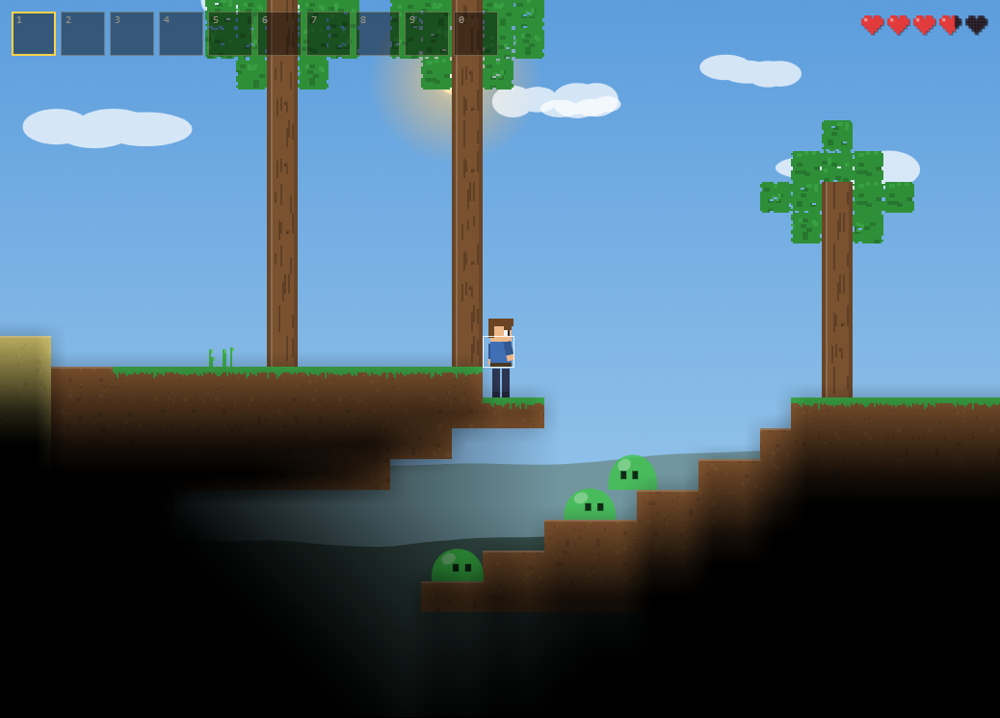

# clone-terraria

An original-assets, from-scratch Terraria-style 2D sandbox game. Vanilla JavaScript +
HTML5 Canvas. No frameworks, no build step to play, no external assets: all graphics are
drawn procedurally in code, all audio is synthesized with WebAudio. Not affiliated with
Re-Logic; no copyrighted Terraria assets, code, or audio are used.



## Run

Open `index.html` in a browser (plain `<script>` tags, works over `file://`), or serve:

```
python -m http.server 8377
```

Development/validation commands (`node` >= 22 (glob-capable `node --test`) + `npm ci` required):

```
npm test            # node:test suites (unit/core/save/combat/player/npc/world)
npm run test:browser  # Playwright journeys (headless Chromium)
npm run build       # reproducible dist/ assembly
npm run validate    # syntax + tests + build + build-verify + browser suite
```

## Controls

| Input | Action |
|---|---|
| `A`/`D` or arrows | Move (1-tile auto step-up) |
| `Space`/`W`/`Up` | Jump / swim / drop through platforms with `S` |
| Left mouse | Mine / place / attack (hold to keep using) |
| Right mouse | Interact: chests, doors, NPCs, wiring devices |
| `1`–`0`, mouse wheel | Select hotbar slot |
| `E` | Inventory + crafting panel |
| `Esc` | Close panel / pause menu (save, quit, sound) |
| `M` / `N` / `F3` | Mute / minimap / debug overlay |

## Features

### World

- 1200×400-tile deterministic worlds from named generation passes (v3): rolling surface,
  deserts, snow, jungle, oceans, corruption, dungeon and pyramid structures, worm+cheese
  caves, a deep-cave layer, micro-biomes (crystal caverns, mushroom grottos, granite,
  marble, moss caves), copper→iron→silver→gold ore veins plus gleam crystal, trees,
  water/lava pockets, underworld.
- Tile shapes: platforms, half-blocks and slopes with hammer reshaping; background wall
  layer (mineable, persisted); flowing water/lava/honey on an independent volume layer
  with buckets; flood-fill lighting with dynamic light sources.

### Progression & combat

- Tool/armor tiers copper → iron → silver → gold (+ gleam-crystal endgame blade);
  workbench → furnace → anvil crafting chain with tagged ingredients and station tags.
- Melee arc combat, bows, magic weapons with a mana pool, thrown gear (yoyo, boomerang,
  grenades), grappling hooks, fishing rods with per-zone loot and daily quests.
- Enemies across every biome (slimes, zombies, demon eyes, bats, harpies, vultures,
  skeletons, granite golems, snapvines, frost wolves, void wisps…), Blood Moon events,
  accessory equipment slots with stat prefixes, potion buffs/debuffs (incl. burning).
- Bosses: Eye of the Void, King Slime, Skeletron (+ hands), Storm Jelly, Moss Mother,
  and a production Wall of Flesh gateway — a direction-locked sweeping wall with
  enter→phase2→enrage, telegraphed bolt fans, tethered Hungry servants and
  `infernal_core` loot. Boss kills persist progression flags that unlock recipes
  (Hellforged Blade, Infernal Greaves/Hook), Guide/Merchant stock, and Underworld
  spawns (Ember Wraith).

### Systems

- Canonical content registry (`core:` stable IDs), event bus, command transactions
  (mine/place/craft/equip/buy…) with a deterministic per-tick command queue,
  contributor-based stat resolver, versioned save envelope (SaveCore) with atomic
  writes, backups, export/import and legacy-save migration; per-system save providers.
- One production runtime authority: the fixed-step scheduler (`TC.Runtime` →
  `TC.Systems`) sequences every subsystem; render layers (`TC.RenderLayers`) own the
  draw pipeline; a headless simulation boundary runs the full game loop without
  Canvas/DOM/rAF for deterministic tests and `tools/bench-runtime.js` benchmarks.
- NPCs with housing validation, move-in unlocks, context-aware dialog and an economy
  shop (canonical coin currency); the Guide sells progression hints, not stock.
- Wiring mechanisms (switches, levers, pressure plates, timers, dart traps, actuators),
  breakable pots, life crystals, chest loot, minimap, generative soundtrack that follows
  biome/boss mood, synthesized SFX, deterministic headless test infrastructure
  (node:test + Playwright) and a reproducible release build.

See `docs/ARCHITECTURE.md` for the module/capability matrix and contracts, and
`docs/TASK_BOARD.md` for current implementation status.

## Project layout

```
index.html            script wiring (fixed load order)
css/style.css         minimal page styles
js/constants.js       lead-owned data tables & tuning (tiles, items, recipes, physics)
js/main.js            browser host: canvas lifecycle, transitions, system/layer registration
js/runtime.js         canonical fixed-step host + headless simulation boundary
js/utils.js           seeded RNG, hashes, noise
js/registry.js        stable namespaced content registry + fingerprint
js/events.js          deferred event bus
js/systems.js         update-phase scheduler + render layers + boot tasks
js/savecore.js        versioned save envelope, providers, atomic IO
js/commands.js        canonical player/system transactions
js/worldgen.js        deterministic pass-based world generation
js/world.js           tile/wall storage, chunks, mining damage, support rules
js/tiles.js           procedural tile/wall rendering, shapes, platforms
js/liquids.js         independent liquid layer (water/lava/honey)
js/lighting.js        flood-fill light propagation + overlay
js/sky.js             day/night cycle, celestial bodies, weather visuals
js/biomes.js          biome detection, tints, spawn overrides
js/input.js           keyboard/mouse state, cursor
js/audio.js           WebAudio SFX synthesis
js/music.js           generative soundtrack
js/particles.js       particle pool + floating text
js/items.js           inventory, drops, icons, chests
js/economy.js         canonical currency + shop math
js/player.js          movement, collision, item use, armor, summons
js/accessories.js     accessory slots/prefixes + TC.Buffs status effects
js/stats.js           contributor-based stat resolver
js/magic.js           mana pool + magic weapons
js/fishing.js         rods, bait, bite windows, zone loot tables
js/enemydefs.js       enemy/item/recipe content extensions (data only)
js/enemyai.js         reusable AI archetype implementations
js/enemyspawn.js      spawn director, zone tables, Blood Moon event
js/enemies.js         enemy entity lifecycle, damage/death, rendering
js/npcs.js            NPC kinds, housing, dialog, shops
js/projectiles.js     canonical pooled projectile system
js/grapple.js         grappling-hook state machine
js/combat.js          canonical hit resolution + melee/arrows/intake
js/lootables.js       canonical loot-table evaluation + validation
js/loot.js            pots, life crystals, chest population post-pass
js/crafting.js        stations, recipe index, transactional crafting
js/gear.js            yoyo/boomerang/grenade/falling-star behaviors
js/save.js            dual-format persistence facade (v2 envelope + v1 fallback)
js/minimap.js         toggleable minimap
js/ui.js              HUD, inventory/crafting/shop panels, menus, toasts
js/wiring.js          wire tiles + mechanisms
js/debug.js           instrumentation + #test hooks
tests/                node:test suites + Playwright journeys
tools/                dev server, release build, verification scripts
docs/                 architecture contract, task board, parity analysis
AGENTS.md             architecture contract for contributors
```

Modules attach to a single global `window.TC` namespace and follow the API contract in
`AGENTS.md`. The game is built agent-first: one contract, one owner per file.
