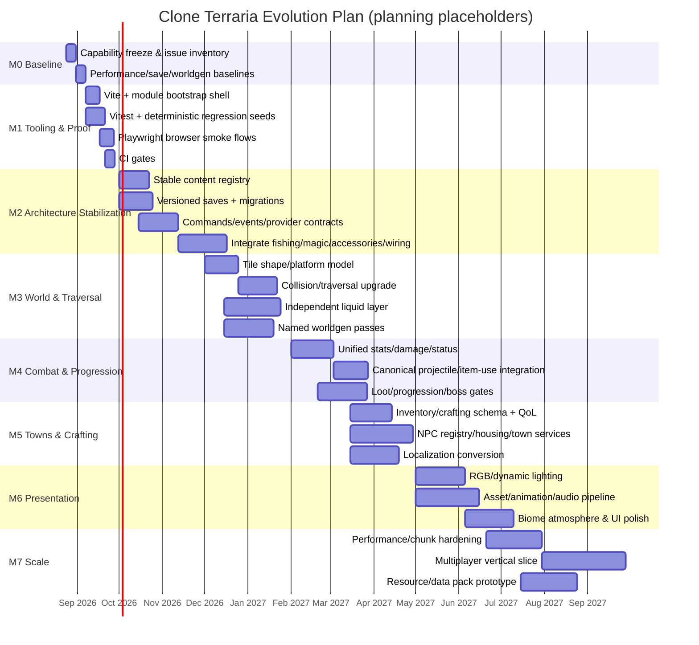

# Implementation Roadmap

This roadmap is ordered by **dependency and risk**, not by flashiness. The dates in the Mermaid diagram are planning placeholders beginning after this documentation branch; effort depends on contributor count and available engineering hours.

## Effort scale

| Label | Interpretation |
|---|---|
| Low | Localized change, roughly 1–3 focused developer-days after prerequisites. |
| Medium | Cross-module feature, roughly 4–10 focused developer-days. |
| High | Major subsystem, usually more than 10 focused developer-days. |
| Very High | Multi-milestone initiative, especially multiplayer/modding/broad content expansion. |

## Milestone map



---

# M0 — Baseline and capability freeze

**Goal:** establish an authoritative picture of current behavior before architecture changes.

### Tasks

- [ ] Create a feature/capability matrix from every `js/*.js` module.
- [ ] Record script load order from `index.html`.
- [ ] Record current tile/wall/item/recipe/enemy IDs and definitions.
- [ ] Capture several known world seeds and structural invariants.
- [ ] Export representative saves containing chests, mined/placed blocks, player gear, bosses/progression, fishing/magic/accessories/wiring state where currently supported.
- [ ] Measure world-generation time, average frame time, worst observed frame spikes and save size.
- [ ] Turn known ad-hoc smoke scripts into a catalog with owner/purpose/result.
- [ ] Document current defects that wrappers are compensating for, especially wiring's mining-path workaround and fishing's persistence gap.

### Acceptance gate

A future agent can answer “did this migration alter current behavior?” using a repeatable baseline rather than memory.

**Effort:** Medium.

---

# M1 — Development, testing and CI foundation

**Goal:** make every subsequent milestone verifiable.

## M1.1 Add Vite as a thin shell

Do not redesign gameplay. Preserve the existing browser entry and introduce a standard dev/build command.

Acceptance:

- dev server launches the game;
- production build launches equivalently;
- direct feature behavior remains unchanged;
- current assets/screenshots are unaffected unless intentionally configured.

**Effort:** Low/Medium.

## M1.2 Incremental JS type checking

Start with contracts most likely to cause systemic bugs:

- content definitions;
- world shape;
- item stacks;
- player serialized state;
- save envelope;
- projectile definitions;
- command/event payloads.

Use JSDoc + `checkJs` before considering broad `.ts` conversion.

**Effort:** Medium, ongoing.

## M1.3 Vitest

Convert smoke logic into proper tests:

- deterministic world generation;
- item stack operations;
- recipe matching;
- damage/stat calculation;
- projectile deterministic motion excluding intended combat randomness;
- save encode/decode/migrations;
- wire pulse graph behavior;
- fishing state serialization.

**Effort:** Medium.

## M1.4 Playwright

Minimal browser journeys:

1. start/new world → spawn → move/mine/place;
2. inventory/crafting interaction;
3. chest open/transfer/close;
4. save → reload → continue;
5. combat an enemy;
6. one advanced feature vertical slice after it is integrated.

Use test-only deterministic hooks rather than pixel-coordinate automation where practical.

**Effort:** Medium.

## M1.5 CI

On pull requests:

```text
format/lint (when configured)
type-check
unit/simulation tests
browser smoke tests
production build
```

Nightly/optional:

```text
large worldgen seed corpus
browser matrix
visual regression
performance benchmark
```

### M1 exit gate

No P0 architecture migration starts until a normal build, deterministic tests and save/load browser test exist.

---

# M2 — Architecture, content identity and persistence

**Goal:** remove the scaling blockers.

## M2.1 Stable content registry

Implement namespaced IDs and schemas for:

- tiles;
- walls;
- items;
- recipes;
- enemies;
- NPCs;
- buffs/statuses;
- projectile types;
- biome IDs;
- crafting stations/tags.

Create a migration map from current numeric IDs.

**Acceptance:** changing module registration order does not change persistent identity.

**Effort:** High.

## M2.2 Save format v2+

- versioned save envelope;
- separate world/character/system state;
- provider registration;
- migration chain;
- backup/recovery;
- export/import;
- integrity validation;
- generation version.

**Acceptance:** all existing representative saves either migrate correctly or fail with an explicit, non-destructive recovery message.

**Effort:** High.

## M2.3 Commands, events and render/update contracts

Introduce canonical transactions and observer events. Add renderer layers and persistence providers.

**Acceptance:** new systems can subscribe/register without replacing core functions.

**Effort:** High.

## M2.4 Integrate advanced modules

Suggested order:

### A. Fishing

- registered item/recipe content;
- save provider;
- biome/liquid context adapter;
- remove persistence gap.

### B. Projectiles

- make existing pool the canonical projectile service;
- redirect legacy arrow lifecycle to it through supported API;
- expose dynamic lights through renderer/lighting contract.

### C. Magic

- canonical mana resource;
- item-use and projectile APIs;
- HUD layer registration;
- serialization provider;
- remove wrappers.

### D. Accessories/buffs

- canonical equipment slots;
- stat/status resolver;
- item-instance prefix model;
- HUD status layer;
- remove wrappers.

### E. Wiring

- canonical world-change events;
- fix mining transaction in core rather than via shim;
- registered persistence;
- migrate wire state toward independent layer;
- remove World/Player/Save wrappers.

### M2 exit gate

- no shipping advanced feature requires undocumented monkey patching;
- stable IDs are used by saves;
- every persistent advanced system survives save/reload;
- module boot order is explicit and validated.

---

# M3 — World interaction, traversal and liquids

**Goal:** deliver the largest “this now feels much closer” change in moment-to-moment play.

## M3.1 Tile-shape model

Add shape metadata separate from tile content:

- full;
- platform/one-way;
- half;
- four slopes.

Then update mining, placement, rendering, ray/reach tests and collision queries.

**Effort:** High.

## M3.2 Collision and movement

- robust swept/iterative AABB collision against tile shapes;
- platform drop-through;
- smooth slope stepping;
- fall damage based on resolved landing;
- consistent knockback/collision behavior;
- movement capability modifiers.

Then add a grapple/hook vertical slice using canonical projectiles/anchors.

**Effort:** High.

## M3.3 Independent liquid simulation

Data:

```text
type + amount per cell
```

Implement incrementally:

1. static representation + rendering;
2. persistence;
3. player immersion/breath/buoyancy;
4. settling queue;
5. flow;
6. interactions;
7. buckets;
8. pumps/wiring integration.

Use dirty/active-cell queues; never scan the whole world every frame.

**Effort:** High/Very High.

## M3.4 Named world-generation passes

Split existing generator while preserving exact output initially where possible.

Then deepen:

- strata/cave diversity;
- ore distribution;
- structure guarantees;
- micro-biomes;
- biome transition quality;
- generation validation;
- telemetry/timing.

**Effort:** High.

### M3 exit gate

A fixed test seed demonstrates platforms, slopes/half-blocks, liquids, multiple biomes/structures and stable save/reload with no world corruption.

---

# M4 — Combat, enemies, loot and progression

**Goal:** turn existing combat breadth into a coherent progression system.

## M4.1 Unified stat resolver

Migrate accessories, buffs and class modifiers.

Acceptance: a debug panel/test can explain every final stat as a list of contributors.

## M4.2 Unified damage model

- damage classes;
- crit/variance policy;
- defense/penetration;
- immunity frames;
- knockback;
- status effects;
- structured damage results.

## M4.3 Projectile canonicalization

Keep the current pooled `projectiles.js` concepts, but move definitions to registries and lifecycle to explicit system ordering.

## M4.4 Enemy definitions + reusable AI

Break giant conditionals/data mixtures into:

- definition;
- spawn rule;
- AI behavior/state machine;
- loot table;
- progression condition.

## M4.5 Boss/event progression

Define world flags:

```text
boss.foo.defeated
event.bar.completed
world.hard_phase
```

Progression changes may unlock:

- spawns;
- recipes;
- NPCs;
- loot;
- biome/world transformations;
- music/event state.

### M4 exit gate

At least one complete early-game progression arc—from spawn through resource acquisition, crafting, exploration and a boss/event—runs exclusively through the new shared combat/progression contracts.

---

# M5 — Inventory, crafting, towns and localization

## M5.1 Inventory QoL

- accessory/equipment canonicalization;
- quick transfer;
- stack split;
- sort;
- quick stack/deposit all;
- favorites/locked slots;
- tooltip consistency;
- controller-ready action abstraction if desired later.

## M5.2 Crafting schema

- ingredient tags;
- station tags;
- conditions;
- indexed recipe queries;
- search/filter;
- craftable-only state;
- deterministic transaction.

## M5.3 Generic NPC/town system

- NPC registry;
- move-in/unlock conditions;
- home assignment;
- housing validator;
- shops/services;
- death/respawn;
- biome/town context;
- persistent state.

## M5.4 Localization

Externalize user-facing strings before mass content production. Include item names/descriptions, UI labels, NPC dialogue, errors, accessibility text and keybind labels.

### M5 exit gate

Adding a new town NPC, shop item, recipe and localized text should primarily be data authoring—not core-engine patching.

---

# M6 — Presentation, UX and original content pipeline

## M6.1 Lighting

- RGB channels;
- dirty chunks;
- dynamic entity/projectile sources;
- sunlight/ambient source policy;
- low/medium/high quality profiles;
- benchmark scenes.

## M6.2 Visual pipeline

Introduce optional original pixel-art assets with deterministic export metadata. Preserve procedural art as fallback/debug mode.

Add:

- sprite animation state;
- tile framing/variants;
- parallax biome backgrounds;
- particles/trails;
- hit flashes;
- restrained camera shake;
- weather/ambient effects;
- scalable UI.

## M6.3 Audio

- event-driven SFX;
- category mixer;
- biome/time/boss music state;
- crossfades;
- original authored or synthesized assets with provenance.

### M6 exit gate

Presentation has configurable quality levels and does not materially change deterministic simulation results.

---

# M7 — Performance, multiplayer and extensibility

## M7.1 Performance hardening

Introduce chunk/region dirty tracking and spatial indexing where profiling justifies it.

Budgets should cover:

- simulation frame time;
- render frame time;
- entity/projectile count;
- lighting updates;
- liquid active cells;
- save size/time;
- world generation.

## M7.2 Multiplayer vertical slice

Only after headless simulation boundaries exist.

Scope first slice narrowly:

- host/server starts deterministic world;
- two clients connect;
- movement is replicated;
- mining/placing is server-authoritative;
- one enemy/combat interaction is authoritative;
- inventory/world save persists on server;
- disconnect/reconnect is handled.

Do not attempt full-content networking immediately.

## M7.3 Resource/data packs

Resource pack first; declarative data pack second; script mod API last.

---

# Dependency table

| ID | Task | Priority | Effort | Depends on | Unlocks |
|---|---|---:|---:|---|---|
| FND-01 | Vite/dev/build shell | P0 | M | M0 | modules/tests/build |
| FND-02 | Vitest + seed corpus | P0 | M | M0 | safe refactors |
| FND-03 | Playwright save/gameplay smoke | P0 | M | FND-01 | browser gates |
| ARC-01 | Stable content registry | P0 | H | FND-01/02 | saves/mods/content scale |
| ARC-02 | Save schemas/migrations/providers | P0 | H | ARC-01 | reliable persistence |
| ARC-03 | Commands/events/render layers | P0 | H | FND | remove wrappers/multiplayer |
| INT-01 | Integrate fishing | P0/P1 | M | ARC-02/03 | proven provider pattern |
| INT-02 | Canonical projectiles | P0/P1 | M | ARC-01/03 | combat/magic/hooks |
| INT-03 | Integrate magic/accessories | P1 | H | INT-02 + stats | coherent classes |
| INT-04 | Integrate wiring | P1 | H | ARC-03 + world events | mechanisms/pumps |
| PHY-01 | Tile shapes/platforms | P1 | H | ARC | Terraria-like terrain feel |
| PHY-02 | Collision/traversal | P1 | H | PHY-01 | hooks/mobility |
| LIQ-01 | Independent liquid layer | P1 | H/VH | world schema | fluid depth |
| WGEN-01 | Named passes | P1 | H | tests/registry | biome expansion |
| COM-01 | Stats/damage/status | P1 | H | ARC | class progression |
| NPC-01 | Housing/town platform | P1 | H | registry/save | NPC progression |
| CRF-01 | Crafting schema/query | P1 | M/H | registry | content scale |
| LOC-01 | Localization keys/catalog | P1 | M | registry/data cleanup | translated/original content |
| LGT-01 | RGB/dynamic lighting | P2 | H | render/world dirty model | atmosphere |
| ART-01 | Authored asset pipeline | P2 | M | content/render IDs | polish |
| NET-01 | Authoritative multiplayer slice | P2 | VH | simulation separation | online roadmap |
| MOD-01 | Resource/data packs | P2 | H | registry/assets/schema | extensibility |
| MOD-02 | Script API | P3 | VH | stable contracts/security | full mods |

---

# Parallelization strategy

After M1/M2 contracts stabilize, several streams can run in parallel with disjoint ownership:

### Stream A — World

Tile shapes, collisions, liquids, worldgen, biome context.

### Stream B — Combat

Stats, damage, projectile integration, status effects, enemy definitions.

### Stream C — Progression/content

Loot, crafting, NPCs, housing, shops, localization/content schemas.

### Stream D — Presentation

Renderer layers, lighting, backgrounds, animation, audio, UI.

### Stream E — Quality

Tests, benchmarks, save fixtures, CI, debugging tools.

The orchestrating agent must enforce shared-schema ownership. Streams should not independently change content IDs, save envelopes or command/event payloads without an architecture decision.

---

# Definition of “production-ready milestone”

For any milestone to be considered complete:

- no Critical/High known regression remains in the touched system;
- save compatibility is proven for persistent changes;
- deterministic invariants pass on fixed seeds;
- normal browser play flow is automated;
- new public contracts are documented;
- no untracked monkey patch is added;
- performance is measured where relevant;
- original asset/IP provenance is preserved;
- task board reflects what is done and what moved.

The intended result is continuous playable improvement, not a long rewrite branch that only becomes runnable at the end.